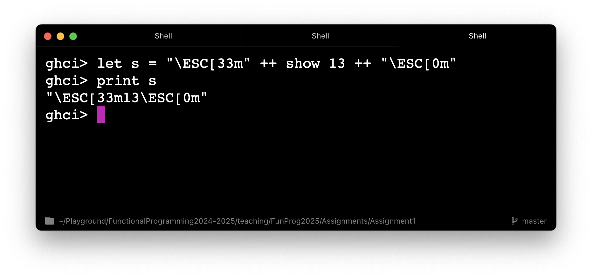
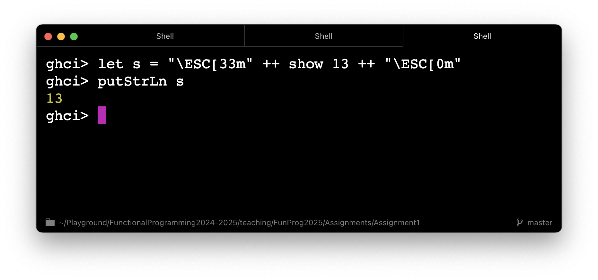
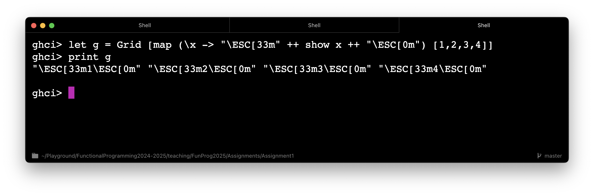
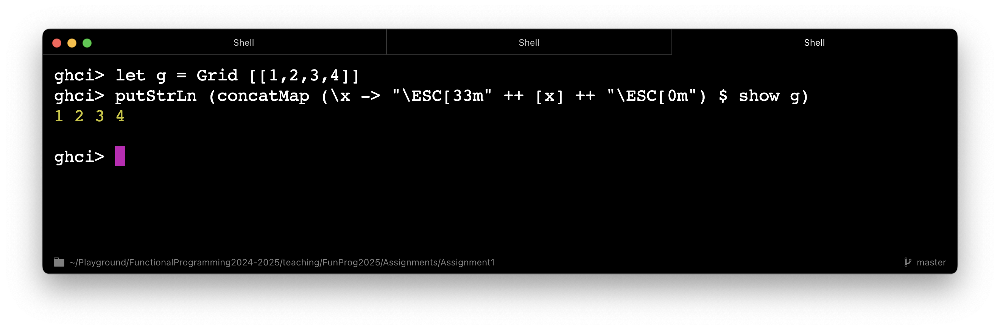

Some may have noticed the following behaviour when printing strings that contain escape sequences:

</img>

This happens because of how the `Show` instance for the `String` type is defined. When a string contains escape sequences, calling `show` on it produces a version where those sequences are **escaped again** so that they are visible in the output. Because `print s = putStrLn (show s)`, in the above example, we essentially call `show` on the string, which results in the observed behaviour. One way to avoid it is to call `putStrLn` directly:

</img>

The same logic applies when printing `Grid` values, compare

</img>

and

</img>

So you need to be wary of this when defining the `Show` instance for `GridWithAPointer` type.
